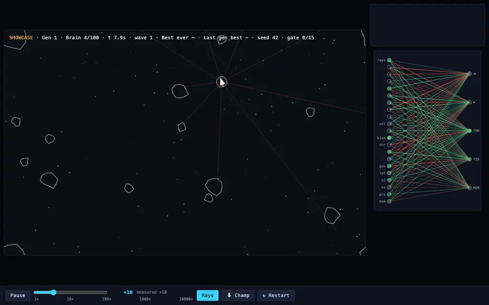

# Neuroevolution Asteroids

Neural networks learn to play Asteroids — evolved live in your browser by NEAT, no servers, no build step.

**[Live demo](https://nicolas-found42.github.io/neural-network-game/)**



<sub>Animated GIF deferred (no ffmpeg on the capture machine); static PNG stands in.</sub>

This is **Neuroevolution of Augmenting Topologies** (NEAT): each ship is driven
by a small neural network, and the networks themselves evolve — weights mutate,
nodes and connections are added, and genomes are crossed over. A shared
innovation tracker plus a compatibility-threshold speciation loop let new
structure survive long enough to find a use instead of being crowded out by
the current best.

Each ship senses its world through 9 vision rays (the arena is toroidal, so
rocks are seen across the seams), its own velocity, and threat telemetry:
bearing, closeness, closing and lateral velocity of the nearest rock, the
second-nearest rock, threat size, and encirclement pressure. A memory output
feeds back as an input next step, giving the net a learnable internal state.
Outputs: turn left, turn right, thrust, fire — plus that memory channel.

Fitness rewards staying alive, keeping moving, using all controls (action
entropy), and being behaviorally novel early on — the novelty bonus decays over
generations so exploration gives way to exploitation. The HUD tracks a
separate competence gate (alive time, wave reached, rocks destroyed) so you
can watch raw skill apart from the shaped score.

## Controls

| Control | Effect |
|---|---|
| Pause / Resume | freezes the evaluation loop |
| Speed slider | 1× – 10 000× sim speed (log scale; measured rate shown) |
| Rays | overlay the ship's 9 vision rays |
| ↻ Restart | replay the pinned seed from gen 0, or roll a fresh run |
| ⬇ Champ | download the best genome of this run so far (JSON) |

## Sharing runs

- `?seed=N` — replays a run deterministically from generation 1. Every run's
  seed lives in the URL, so any run you start is shareable retroactively.
- `?champ=champions/42-g29-2026-08-19.json` — showcase mode: every brain slot
  replays the exported champion instead of evolving. Combine with a seed for a
  fixed demonstration.
- Champion files work anywhere in the repo; serve over http (e.g.
  `python3 -m http.server`), not `file://` (CORS blocks the fetch).

## Further reading

The fitness shaping follows cited research; see the comments in
[`js/config.js`](js/config.js) for the full notes:

- arXiv:2311.02283 — objective decomposition (movement reward)
- arXiv:1006.4959 — sensorimotor entropy bonus
- arXiv:2608.12534 — entropy-augmented fitness
- arXiv:1902.03142 — action-based behavior descriptors (novelty)
- arXiv:2209.03618 — decaying explore/exploit bonus

## Hacking

Zero dependencies; ES modules only. Verify the whole contract headless:

```sh
node verify.mjs
```

Run evolution headless (the tuning evidence tool — same seeded stream, same
gate rules as the browser):

```sh
node dev/evolve.mjs --seed 1 --gens 40
```

Tuning decisions and session evidence live in [TUNING.md](TUNING.md).
